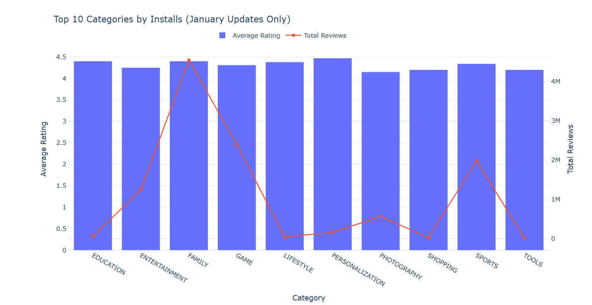
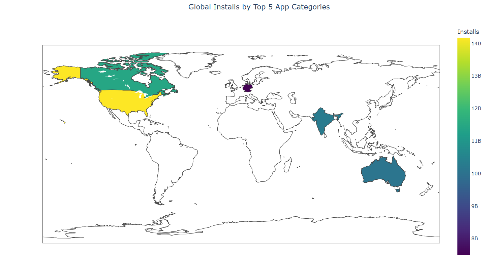
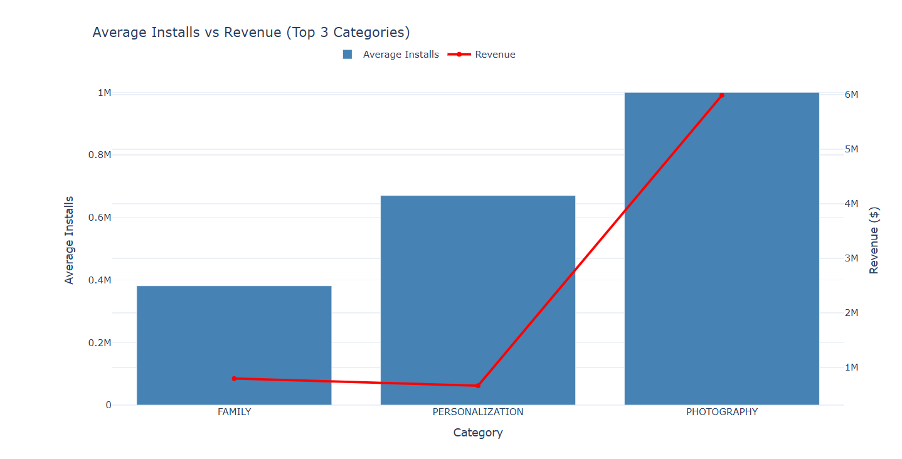
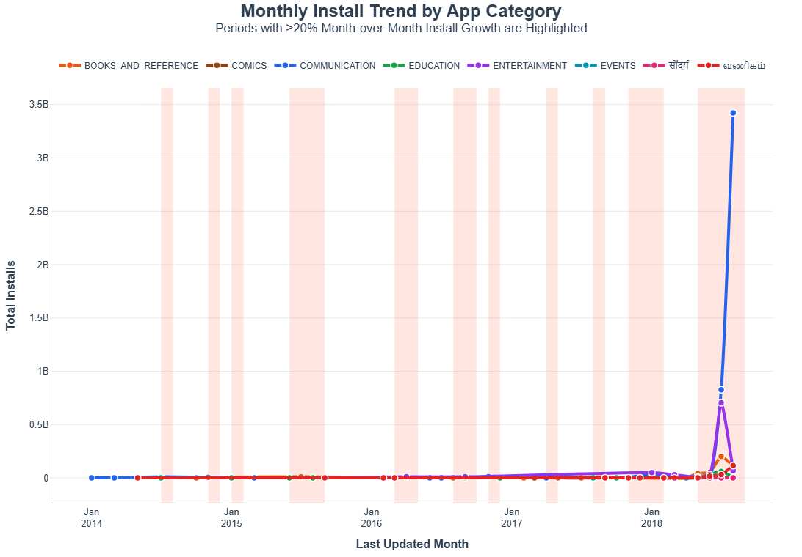
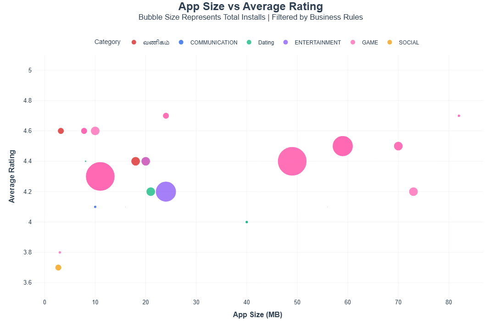
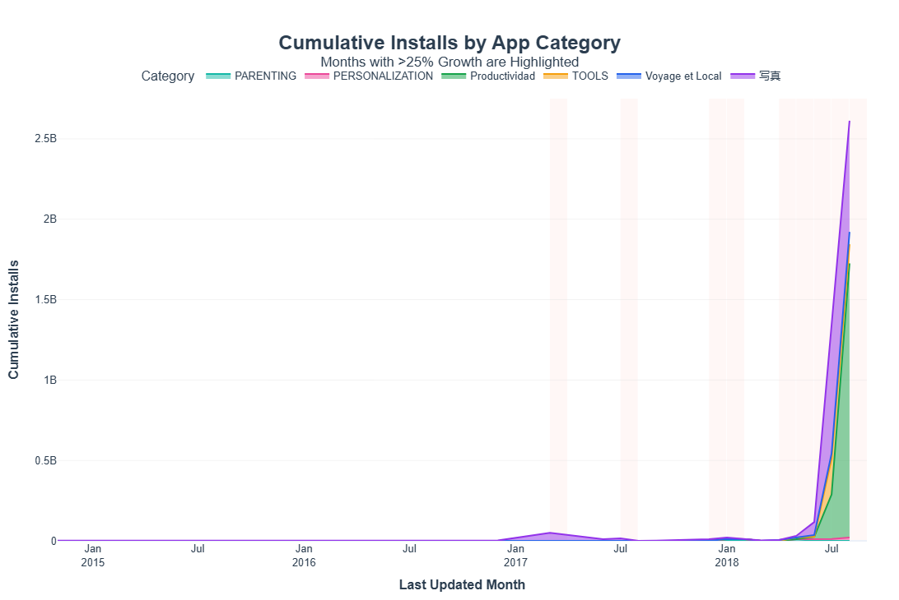

# 📊 Google Play Store Analytics

A comprehensive data analytics project that explores, cleans, and visualizes Google Play Store applications and user reviews. Built using Python, Jupyter Notebooks, Pandas, NumPy, and Plotly, this project provides interactive insights and an automated HTML dashboard.

---

## 📝 Project Overview

The objective of this project is to perform end-to-end data analytics on the Google Play Store marketplace. We clean the dataset, merge applications with their user sentiment scores, perform exploratory data analysis (EDA), and build interactive visualizations. These visualizations are compiled into a dashboard to help developers and businesses understand critical marketplace trends (such as installations, ratings, pricing, and sentiments).

---

## 🗄️ Dataset Description

The analysis uses two primary datasets:

1. **Apps Dataset (`data/Play Store Data.csv`)**: Contains metadata for 10,841 apps on the Google Play Store, including details like category, rating, size, installations, type (free vs. paid), pricing, target content ratings, genres, and last update times.
2. **User Reviews Dataset (`data/User Reviews.csv`)**: Contains the top 100 user reviews for each app, including translated English text and pre-calculated sentiment scores (sentiment classification, polarity, and subjectivity).

---

## 🧰 Technologies Used

* **Programming Language**: Python 3.8+
* **Data Manipulation**: Pandas, NumPy
* **Data Visualization**: Plotly, Plotly Express
* **Interactive Environment**: Jupyter Notebook

---

## 📁 Project Structure

Each task's deliverables (such as CSV summaries, static charts, and interactive HTML plots) are organized and stored inside its corresponding subfolder under the `tasks/` directory.

```text
Google-Play-Store-Analytics/
├── .gitignore                      # Git configuration to ignore temporary/cached files
├── README.md                       # Project documentation and guide
├── requirements.txt                # List of required python packages
├── data/                           # Folder containing play store CSV datasets
│   ├── Play Store Data.csv         # Raw applications dataset
│   └── User Reviews.csv            # Raw user reviews dataset
├── notebooks/                      # Jupyter Notebook files
│   ├── Google_Play_Store_Analytics.ipynb        # Main analysis notebook
│   ├── Analysis3.ipynb                          # Legacy dashboard plotting notebook
│   ├── Analysis2.ipynb                          # Legacy pipeline notebook
│   └── Analysis.ipynb                           # Legacy Tkinter experiment notebook
└── tasks/                          # Folder containing task-specific deliverables
    ├── Task_1/                     # Deliverables for Task 1
    │   ├── task1_chart.html        # Interactive chart (HTML)
    │   ├── task1_chart.png         # Static chart (PNG)
    │   └── task1_summary.csv       # Summary data table (CSV)
    ├── Task_2/                     # Deliverables for Task 2
    │   ├── task2_chart.html        # Interactive chart (HTML)
    │   ├── task2_chart.png         # Static chart (PNG)
    │   └── task2_summary.csv       # Summary data table (CSV)
    ├── Task_3/                     # Placeholder for Task 3
    ├── Task_4/                     # Placeholder for Task 4
    ├── Task_5/                     # Placeholder for Task 5
    └── Task_6/                     # Placeholder for Task 6
```

---

## ✅ Tasks Completed

### 🎯 Task 1: Top Categories Analysis [Completed]
* Analysed and visualized average rating and total review counts for the top 10 app categories based on installs under specific filters.

### 🎯 Task 2: Interactive Choropleth Map [Completed]
* Visualized global installations across representative countries for the top 5 app categories satisfying category exclusions and installation thresholds.

### 🎯 Task 3: Dual-Axis Category Analysis [Completed]
* Compared average installations and estimated revenue for the top 3 categories of paid applications that satisfy specific size, length, rating, and version rules.

### 🎯 Task 4: Time Series Analysis of Total Installs [Completed]
* Analyzed month-over-month growth of total installations for specific app categories, highlighting significant changes (>20%) with category translations.

### 🎯 Task 5: App Size vs Average Rating Analysis [Completed]
* Visualized correlation between app size (MB) and average user rating using an interactive bubble chart with merged sentiment subjectivity metrics.

### 🎯 Task 6: Stacked Area Chart (Cumulative Installs) [Completed]
* Analyzed monthly cumulative installations for qualifying categories starting with T or P, highlighting months with >25% growth and category translations.

---

## 📈 Task 1: Top Categories Analysis

### Objective
Compare the average user rating and total review counts of the top 10 app categories (ranked by total installations) under strict business requirements and filtering rules.

### Filters Applied
* **Rating**: $\ge$ 4.0
* **Size**: $\ge$ 10 MB (converts the size text to megabytes, filtering out smaller apps)
* **Last Updated**: Month of update must be January (e.g., `df["Last Updated"].dt.month == 1`)

### Visualization Used
An interactive grouped chart featuring a dual y-axis:
* **Primary Y-Axis (Left)**: Average Rating (represented as blue bars, ranging from 0 to 4.5).
* **Secondary Y-Axis (Right)**: Total Reviews (represented as a red line trace, ranging from 0 to 4.5 million).
* **Scheduling Restriction**: The visualization is timezone-aware and only executes between 3:00 PM and 5:00 PM IST.



### Key Insights
* **Highest Engagement**: The `FAMILY` category accumulated by far the highest number of reviews (~4.54 million), demonstrating exceptionally high user interaction under these conditions.
* **Top Ratings**: `PERSONALIZATION` achieved the highest average rating of **4.47**, followed closely by `FAMILY` (4.40) and `EDUCATION` (4.40).
* **Lowest Ratings**: `PHOTOGRAPHY` recorded the lowest average rating (**4.15**) among the top 10 categories.
* **Review Disparity**: Categories like `SHOPPING` and `TOOLS` showed very low review totals under these filters, despite having high overall install volumes.

---

## 🌍 Task 2: Interactive Choropleth Map

### Objective
Create an interactive choropleth map using Plotly to visualize app installations across representative countries for the top 5 app categories under specific filtering criteria.

### Filters Applied
* **Category Exclusions**: Excludes categories starting with the letters `A`, `C`, `G`, or `S` (e.g., `ART_AND_DESIGN`, `COMMUNICATION`, `GAME`, `SHOPPING`, etc.).
* **Installation Threshold**: Only includes categories with total installs greater than 1,000,000.
* **Top Categories**: Selects the top 5 categories based on total installs after applying the above exclusions.

### Country Assignment (Assumptions)
Since the original dataset does not contain geographical information, representative countries were mapped as follows for visualization purposes:
* **PRODUCTIVITY** $\rightarrow$ United States (14.18B Installs)
* **TOOLS** $\rightarrow$ Canada (11.45B Installs)
* **FAMILY** $\rightarrow$ India (10.26B Installs)
* **PHOTOGRAPHY** $\rightarrow$ Australia (10.09B Installs)
* **NEWS_AND_MAGAZINES** $\rightarrow$ Germany (7.50B Installs)

### Visualization Used
An interactive global Plotly Choropleth map using the Viridis color scale.
* **Scheduling Restriction**: The visualization is timezone-aware and only executes between 6:00 PM and 8:00 PM IST.



### Key Insights
* **Productivity Dominance**: The `PRODUCTIVITY` category (mapped to the US) recorded the highest volume of installs under these rules, exceeding 14 billion.
* **Category Focus**: Excluding gaming and social categories shifts the focus to utility-focused applications (Tools, Productivity, and Photography) which account for massive volumes of installations.
* **Legacy Distribution**: Even with strict alphabetical exclusions, categories like `FAMILY` and `NEWS_AND_MAGAZINES` remain highly relevant.

---

## 📊 Task 3: Dual-Axis Category Analysis (Installs vs. Revenue)

### Objective
Compare the average installations and estimated revenue for the top 3 categories of paid applications under strict business filtering rules.

### Filters Applied
* **Min Installations**: $\ge$ 10,000
* **Content Rating**: Target rating must be `Everyone`
* **App Name Length**: App name must not exceed 30 characters
* **Application Size**: App size must be greater than 15 MB
* **Estimated Revenue**: Revenue must be $\ge$ $10,000. (Since Revenue = Price $\times$ Installs, this implicitly excludes all Free apps, focusing only on Paid apps).

### Visualization Used
A grouped dual-axis chart comparing installations and revenue side-by-side:
* **Primary Y-Axis (Left)**: Average installations represented as a steel blue bar chart.
* **Secondary Y-Axis (Right)**: Total estimated revenue represented as a red line trace with marker points.
* **Scheduling Restriction**: Time-gated to execute and render only between 1:00 PM and 2:00 PM IST.



### Key Insights
* **Photography Revenue Leader**: The `PHOTOGRAPHY` category generated the highest total estimated revenue (~$5.99 million) with an average of 1,000,000 installations per app.
* **Family Installs & Revenue**: The `FAMILY` category generated ~$796,900 in revenue with an average of ~381,429 installations.
* **Personalization Performance**: `PERSONALIZATION` generated ~$666,633 in revenue with an average of 670,000 installations.
* **Exclusion of Free Apps**: Due to the minimum revenue filter, all Free apps (which make up the majority of the Play Store) were excluded, showing the performance of high-value paid apps.
---

## 📈 Task 4: Time Series Analysis of Total Installs

### Objective
Examine the month-over-month trend and growth of total installations for specific app categories using a professional time-series visualization.

### Filters Applied
* **Reviews**: App reviews count must be > 500.
* **App Name Exclusions**: App names should not start with `X`, `Y`, or `Z`.
* **App Name Character Filter**: App names should not contain the letter `S` (case-insensitive).
* **Category Filter**: Category must begin with the letters `B`, `C`, or `E`.

### Category Translations
Translations were applied to show localized names on the chart:
* **BEAUTY** $\rightarrow$ `सौंदर्य` (Hindi)
* **BUSINESS** $\rightarrow$ `வணிகம்` (Tamil)
* **DATING** $\rightarrow$ `Dating` (German)
* *Note: The Dating category is not visible because it starts with 'D' and was filtered out by the B, C, E prefix rule.*

### Visualization Used
An interactive Plotly time-series line chart with markers, mapping total installs by month for each qualifying category.
* **Growth Highlighting**: Points showing month-over-month installation growth of $>20\%$ are marked with distinct icons or callouts.
* **Scheduling Restriction**: The visualization is timezone-aware and only executes between 6:00 PM and 9:00 PM IST.



### Key Insights
* **Communication Leader**: The `COMMUNICATION` category recorded the highest volume of total installations across all months.
* **Growth Fluctuations**: Significant month-over-month spikes ($>20\%$) occurred in multiple categories, highlighting periods of increased consumer demand or user updates.
* **Filter Impact**: Restricting name prefixes (excluding X, Y, Z, and S) significantly limited the number of active apps evaluated in each category.

---

## 🫧 Task 5: App Size vs. Average Rating Bubble Chart

### Objective
Analyze the relationship between application size (in MB) and average rating using a multi-dimensional bubble chart that integrates user sentiment subjectivity.

### Filters Applied
* **Rating**: $\ge 3.5$
* **Installs**: $> 50,000$
* **Reviews**: $> 500$
* **Categories**: `GAME`, `BEAUTY`, `BUSINESS`, `COMICS`, `COMMUNICATION`, `DATING`, `ENTERTAINMENT`, `EVENTS`, `SOCIAL`.
* **App Name Filter**: App name must not contain the letter `S` (case-insensitive).
* **Sentiment Subjectivity**: Average sentiment subjectivity of the app reviews must be $> 0.5$ (calculated by merging with the `User Reviews` dataset).

### Category Translations & Styling
* **BEAUTY** $\rightarrow$ `सौंदर्य` (Hindi)
* **BUSINESS** $\rightarrow$ `வணிகம்` (Tamil)
* **DATING** $\rightarrow$ `Dating` (German)
* **Color Customization**: The `GAME` category is specifically highlighted in Pink (`#FF69B4`). Other categories are mapped to standard scales.

### Visualization Used
An interactive Plotly bubble chart:
* **X-Axis**: App Size (in MB).
* **Y-Axis**: Average user rating.
* **Bubble Size**: Proportional to the total number of installations.
* **Color**: Represents the category.
* **Scheduling Restriction**: Timezone-aware check that only displays/renders between 5:00 PM and 7:00 PM IST.



### Key Insights
* **Game Dominance**: The `GAME` category (highlighted in pink) contains the highest density of qualifying applications.
* **Weak Size-Rating Correlation**: Application size (MB) is weakly correlated with user ratings; both small and large apps achieve high ratings.
* **User Sentiment**: Filtering for subjectivity $>0.5$ shifts the dataset towards apps with more subjective, emotional reviews.
* **Condition Exclusions**: No apps in the `BEAUTY`, `COMICS`, or `EVENTS` categories satisfied all strict constraints (e.g. installs $>50k$ and subjectivity $>0.5$), excluding them from the bubble plot.

---

## 📈 Task 6: Cumulative Installs Stacked Area Chart

### Objective
Visualize the monthly cumulative installations over time for specific app categories, highlighting key growth periods and translating category names.

### Filters Applied
* **Rating**: $\ge 4.2$
* **App Name Exclusions**: App names should not contain any numeric digits (e.g. no numbers).
* **Category Prefixes**: Category must begin with the letters `T` or `P` (e.g., `TOOLS`, `TRAVEL_AND_LOCAL`, `PERSONALIZATION`, `PRODUCTIVITY`, `PARENTING`).
* **Reviews**: App reviews count must be $> 1000$.
* **Application Size**: App size must be between 20 MB and 80 MB.

### Category Translations
Category names were translated into target languages:
* **Travel & Local** $\rightarrow$ `Voyage et Local` (French)
* **Productivity** $\rightarrow$ `Productividad` (Spanish)
* **Photography** $\rightarrow$ `写真` (Japanese)
* *Note: Photography (写真) starts with 'P' and is included. Travel & Local starts with 'T' and is included. Productivity starts with 'P' and is included.*

### Visualization Used
An interactive Plotly stacked area chart displaying the cumulative sum of installs by month for each translated category.
* **MoM Growth Highlighting**: Points showing month-over-month growth exceeding $25\%$ are highlighted with visible visual indicators on the chart.
* **Scheduling Restriction**: The visualization is timezone-aware and only executes and displays between 4:00 PM and 6:00 PM IST.



### Key Insights
* **Productivity Surge**: The Spanish-translated `Productividad` category represents the largest cumulative installations under these constraints, reaching over 1.7 billion installations by August 2018.
* **Photography Growth**: The Japanese-translated `写真` category accumulated over 691 million installations by August 2018, exhibiting multiple high-growth months.
* **Parenting and Personalization**: `PARENTING` and `PERSONALIZATION` categories maintain steady but smaller cumulative volumes under these constraints.
* **Identified Growth Points**: Multiple month-over-month growth spikes ($>25\%$) were successfully detected and highlighted, such as `Productividad` in June 2018 ($14,900\%$ growth) and `Voyage et Local` in April 2018 ($9,900\%$ growth).

---

## ⚙️ Installation Instructions

To set up the project locally, follow these steps:

1. **Clone the Repository**:
   ```bash
   git clone https://github.com/prathamesh-1105/Google-Play-Store-Analytics.git
   cd Google-Play-Store-Analytics
   ```

2. **Create and Activate a Virtual Environment**:
   * **Windows (PowerShell)**:
     ```powershell
     python -m venv venv
     .\venv\Scripts\Activate.ps1
     ```
   * **macOS/Linux**:
     ```bash
     python3 -m venv venv
     source venv/bin/activate
     ```

3. **Install Required Dependencies**:
   ```bash
   pip install -r requirements.txt
   ```

---

## 🚀 How to Run the Notebook

1. **Start the Jupyter Notebook Server**:
   ```bash
   jupyter notebook
   ```

2. **Run the Notebook**:
   * Navigate to the `notebooks/` folder inside the Jupyter browser.
   * Open [Google_Play_Store_Analytics.ipynb](file:///c:/Users/Prathamesh/Desktop/Google_Playstore_Project/notebooks/Google_Play_Store_Analytics.ipynb).
   * Click **Cell -> Run All** from the top menu to run the analysis.

---

## 💡 Future Improvements

* **Interactive Web App**: Migrate the Plotly charts to a live dashboarding framework like Dash or Streamlit.
* **Auto-updating Pipelines**: Integrate the script with the Google Play Store API to fetch and analyze weekly app changes dynamically.
* **Machine Learning Integration**: Build predictive models to estimate an app's installation tier or rating based on size, category, and price.

---

## 👤 Author Information

* **Developer**: Prathamesh
* **GitHub Repository**: [Google-Play-Store-Analytics](https://github.com/prathamesh-1105/Google-Play-Store-Analytics)
