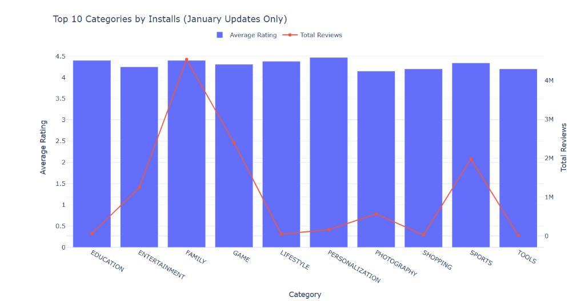

# 📊 Google Play Store Analytics

A comprehensive data analytics project that explores, cleans, and visualizes Google Play Store applications and user reviews. Built using Python, Jupyter Notebooks, Pandas, NumPy, and Plotly, this project provides interactive insights and an automated HTML dashboard.

---

## 📝 Project Overview

The objective of this project is to perform end-to-end data analytics on the Google Play Store marketplace. We clean the dataset, merge applications with their user sentiment scores, perform exploratory data analysis (EDA), and build interactive visualizations. These visualizations are compiled into a dashboard to help developers and businesses understand critical marketplace trends (such as installations, ratings, pricing, and sentiments).

---

## 🗄️ Dataset Description

The analysis uses two primary datasets:

1. **Apps Dataset (`data/Play Store Data.csv`)**: Contains metadata for 10,841 apps on the Google Play Store, including details like category, rating, size, installations, type (free vs. paid), pricing, target content ratings, genres, and last update times.
2. **User Reviews Dataset (`data/User Reviews.csv`)**: Contains the top 100 user reviews for each app, including translated English text and pre-calculated sentiment scores (sentiment classification, polarity, and subjectivity).

---

## 🧰 Technologies Used

* **Programming Language**: Python 3.8+
* **Data Manipulation**: Pandas, NumPy
* **Data Visualization**: Plotly, Plotly Express
* **Interactive Environment**: Jupyter Notebook

---

## 📁 Project Structure

```text
Google-Play-Store-Analytics/
├── .gitignore                      # Git configuration to ignore temporary/cached files
├── README.md                       # Project documentation and guide
├── requirements.txt                # List of required python packages
├── assets/                         # Folder for storing design and image assets
├── screenshots/                    # Folder for saving dashboard screenshots
├── data/                           # Folder containing play store CSV datasets
│   ├── Play Store Data.csv         # Raw applications dataset
│   └── User Reviews.csv            # Raw user reviews dataset
├── docs/                           # Documentation and analytical reports
│   ├── data_dictionary.md          # Description of dataset columns
│   ├── business_requirements.md    # Outline of key analytical objectives
│   └── task1_summary.csv           # Table summary exported from Task 1
└── notebooks/                      # Jupyter Notebook files
    ├── Google_Play_Store_Analytics.ipynb        # Task-specific analysis notebook
    ├── Analysis3.ipynb                          # Legacy dashboard plotting notebook
    ├── Analysis2.ipynb                          # Legacy pipeline notebook
    └── Analysis.ipynb                           # Legacy Tkinter experiment notebook
```

---

## ✅ Tasks Completed

### 🎯 Task 1: Top Categories Analysis [Completed]
* Analysed and visualized average rating and total review counts for the top 10 app categories based on installs under specific filters.

### 🎯 Task 2: [Placeholder]
* *Description/Objective of Task 2 will be documented here.*

### 🎯 Task 3: [Placeholder]
* *Description/Objective of Task 3 will be documented here.*

### 🎯 Task 4: [Placeholder]
* *Description/Objective of Task 4 will be documented here.*

### 🎯 Task 5: [Placeholder]
* *Description/Objective of Task 5 will be documented here.*

### 🎯 Task 6: [Placeholder]
* *Description/Objective of Task 6 will be documented here.*

---

## 📈 Task 1: Top Categories Analysis

### Objective
Compare the average user rating and total review counts of the top 10 app categories (ranked by total installations) under strict business requirements and filtering rules.

### Filters Applied
* **Rating**: $\ge$ 4.0
* **Size**: $\ge$ 10 MB (converts the size text to megabytes, filtering out smaller apps)
* **Last Updated**: Month of update must be January (e.g., `df["Last Updated"].dt.month == 1`)

### Visualization Used
An interactive grouped chart featuring a dual y-axis:
* **Primary Y-Axis (Left)**: Average Rating (represented as blue bars, ranging from 0 to 4.5).
* **Secondary Y-Axis (Right)**: Total Reviews (represented as a red line trace, ranging from 0 to 4.5 million).
* **Scheduling Restriction**: The visualization is timezone-aware and only executes between 3:00 PM and 5:00 PM IST.



### Key Insights
* **Highest Engagement**: The `FAMILY` category accumulated by far the highest number of reviews (~4.54 million), demonstrating exceptionally high user interaction under these conditions.
* **Top Ratings**: `PERSONALIZATION` achieved the highest average rating of **4.47**, followed closely by `FAMILY` (4.40) and `EDUCATION` (4.40).
* **Lowest Ratings**: `PHOTOGRAPHY` recorded the lowest average rating (**4.15**) among the top 10 categories.
* **Review Disparity**: Categories like `SHOPPING` and `TOOLS` showed very low review totals under these filters, despite having high overall install volumes.

---

## ⚙️ Installation Instructions

To set up the project locally, follow these steps:

1. **Clone the Repository**:
   ```bash
   git clone https://github.com/prathamesh-1105/Google-Play-Store-Analytics.git
   cd Google-Play-Store-Analytics
   ```

2. **Create and Activate a Virtual Environment**:
   * **Windows (PowerShell)**:
     ```powershell
     python -m venv venv
     .\venv\Scripts\Activate.ps1
     ```
   * **macOS/Linux**:
     ```bash
     python3 -m venv venv
     source venv/bin/activate
     ```

3. **Install Required Dependencies**:
   ```bash
   pip install -r requirements.txt
   ```

---

## 🚀 How to Run the Notebook

1. **Start the Jupyter Notebook Server**:
   ```bash
   jupyter notebook
   ```

2. **Run the Notebook**:
   * Navigate to the `notebooks/` folder inside the Jupyter browser.
   * Open [Google_Play_Store_Analytics.ipynb](file:///c:/Users/Prathamesh/Desktop/Google_Playstore_Project/notebooks/Google_Play_Store_Analytics.ipynb).
   * Click **Cell -> Run All** from the top menu to run the analysis.

---

## 💡 Future Improvements

* **Interactive Web App**: Migrate the Plotly charts to a live dashboarding framework like Dash or Streamlit.
* **Auto-updating Pipelines**: Integrate the script with the Google Play Store API to fetch and analyze weekly app changes dynamically.
* **Machine Learning Integration**: Build predictive models to estimate an app's installation tier or rating based on size, category, and price.

---

## 👤 Author Information

* **Developer**: Prathamesh
* **GitHub Repository**: [Google-Play-Store-Analytics](https://github.com/prathamesh-1105/Google-Play-Store-Analytics)
